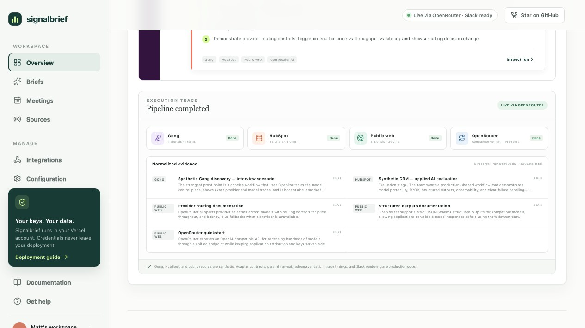
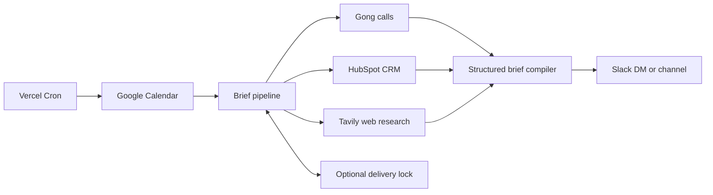

# Signalbrief

**Walk into every call ready.** Signalbrief is an open-source, just-in-time account research agent. It watches a seller’s calendar, gathers relationship context from Gong, opportunity data from HubSpot, and fresh public signals, then delivers a concise pre-call brief in Slack.

[](https://github.com/mherzog4/signalbrief/actions/workflows/ci.yml)
[](LICENSE)
[](https://signalbrief-alpha.vercel.app)

[](https://signalbrief-alpha.vercel.app)

Signalbrief is BYOK and single-workspace by design: deploy it into your own Vercel account, add only the providers you trust, and keep every credential inside your deployment.

## Interview demo

The hosted demo is a transparent production simulation built for evaluating the applied-AI system without requiring access to customer Gong or HubSpot accounts. Three synthetic account scenarios run through the same connector interface, parallel orchestration, evidence schema, structured brief contract, trace instrumentation, and Slack renderer used by live integrations.

**[Run the live production simulation →](https://signalbrief-alpha.vercel.app)**

- Mocked: upstream calendar, Gong, HubSpot, and public-company records.
- Real: API route, adapter fan-out, timing trace, evidence normalization, schema validation, scenario selection, and Slack Block Kit presentation.
- Optional: set `DEMO_USE_LIVE_AI=true` with an OpenRouter key to replace curated fixture output with a live structured model call.
- Optional: set `DEMO_SLACK_DELIVERY_ENABLED=true`, configure Slack, and disable `DRY_RUN` to turn the demo action into a controlled real delivery.

See [docs/interview-demo.md](docs/interview-demo.md) for a five-minute walkthrough, design rationale, and expected technical questions.

## What the first release does

- Scans Google Calendar for external meetings inside a configurable look-ahead window.
- Resolves the account from attendee domains and the meeting title.
- Researches Gong calls, HubSpot company/deal records, and Tavily public web results in parallel.
- Produces a schema-validated, evidence-only brief with OpenAI, Anthropic, or an OpenAI-compatible provider.
- Sends Slack Block Kit messages by bot DM, channel, or incoming webhook.
- Prevents duplicate sends with an optional Upstash Redis lock.
- Runs end to end without any provider keys using a polished demo and deterministic fallback.

## Quick start

Requirements: Node.js 24 LTS and npm.

```bash
git clone https://github.com/mherzog4/signalbrief.git
cd signalbrief
npm install
cp .env.example .env.local
npm run dev
```

Open `http://localhost:3000`. The dashboard starts in demo mode, so no external keys are required.

To exercise the protected compiler endpoint:

```bash
curl -X POST http://localhost:3000/api/briefs/generate \
  -H "Authorization: Bearer $ADMIN_API_KEY" \
  -H "Content-Type: application/json" \
  -d '{}'
```

## Architecture



Each integration implements a small connector contract and returns normalized evidence. Connector failures are isolated, research runs concurrently, and the model only sees normalized evidence. The Slack formatter never renders raw model prose outside the validated brief schema.

See [docs/architecture.md](docs/architecture.md) for boundaries, trust assumptions, and extension points.

## Why this stack

| Layer | Choice | Reason |
| --- | --- | --- |
| Web + API | Next.js 16 App Router | One TypeScript deployment for dashboard, protected routes, and cron endpoint |
| Hosting | Vercel Functions + Cron | Native scheduling and simple self-hosted deployment |
| AI | Vercel AI SDK + Zod | Provider portability and validated structured output |
| State | Upstash-compatible Redis, optional | Atomic delivery locks without requiring a full database |
| UI | React Server Components + CSS | Fast first paint and very little client JavaScript |
| Tests | Vitest + Playwright | Fast contracts plus a real Chromium workflow in CI |

The v1 deployment is intentionally stateless and single-workspace. A database, authentication layer, and stored credential vault become necessary only for a hosted multi-tenant edition; forcing them into the OSS self-hosted path would add cost and attack surface without improving the brief.

## Configure providers

Copy `.env.example` to `.env.local`. All providers are optional, and the health endpoint reports only whether each one is configured—never key values.

### Calendar

Set `GOOGLE_CALENDAR_ID` and `INTERNAL_DOMAINS`, then configure either a short-lived `GOOGLE_ACCESS_TOKEN` or renewable `GOOGLE_CLIENT_ID`, `GOOGLE_CLIENT_SECRET`, and `GOOGLE_REFRESH_TOKEN` credentials. Request only the `calendar.events.readonly` scope. Signalbrief refreshes server-side access automatically and ignores all-day events and meetings without a resolvable external company domain.

For an end-to-end synthetic rehearsal without inviting fake attendees, create an event whose description contains `[signalbrief-demo:meridian-applied-ai]`, `[signalbrief-demo:northstar-validation]`, or `[signalbrief-demo:lumen-first-call]`. The real event title and time trigger the pipeline while Gong, CRM, public signals, and attendees remain clearly labeled scenario fixtures.

The refresh-token adapter is best for one calendar per deployment. For a team deployment, use a managed OAuth installation flow or extend the adapter with Google Workspace domain-wide delegation.

### Gong

Set `GONG_ACCESS_KEY` and `GONG_ACCESS_SECRET`. The key needs `api:calls:read:extensive`. Signalbrief reads call metadata, participants, topics, and tracker signals from the prior 180 days and matches on the account domain.

### HubSpot

Set `HUBSPOT_ACCESS_TOKEN`. Use a private app token with read-only company and deal scopes. The adapter searches the company by domain, then loads associated deals.

### Public research

Set `TAVILY_API_KEY`. The current connector looks back 90 days for company news, leadership, hiring, strategy, and funding signals. Implement `ResearchConnector` to add Exa, Perplexity, a private news index, or another approved source.

### AI and OpenRouter

OpenRouter is the default provider for the demo. Set `OPENROUTER_API_KEY`, choose any supported OpenRouter model ID with `AI_MODEL`, and optionally set `OPENROUTER_APP_NAME` and `OPENROUTER_APP_URL` for attribution. Signalbrief uses OpenRouter’s dedicated Vercel AI SDK provider and structured output support.

Direct OpenAI and Anthropic modes remain available with `AI_PROVIDER=openai` or `AI_PROVIDER=anthropic`. `OPENAI_BASE_URL` also supports another compatible gateway.

If no model key is present, Signalbrief creates a deterministic brief from available evidence. This keeps demos and incident fallbacks usable, but a model is recommended for production-quality prioritization.

The public interview demo keeps `DEMO_USE_LIVE_AI=false` and `DEMO_SLACK_DELIVERY_ENABLED=false` by default, so repeated visitors cannot create provider spend or Slack messages. Turning either on is an explicit operator choice. Demo Slack delivery is separately limited to one message per client per minute.

### Slack

For direct messages, set `SLACK_BOT_TOKEN` and map calendar organizer emails to Slack member IDs with `SLACK_USER_MAP`:

```text
SLACK_USER_MAP={"maya@yourcompany.com":"U012ABCDEF"}
```

The bot needs `chat:write` and `im:write`. If an organizer is not mapped, Signalbrief posts to `SLACK_CHANNEL_ID`. `SLACK_WEBHOOK_URL` is a simpler fixed-channel fallback. Incoming webhooks are credentials: store them as sensitive environment variables and rotate them if exposed.

### Delivery idempotency

Set `UPSTASH_REDIS_REST_URL` and `UPSTASH_REDIS_REST_TOKEN` for durable, cross-instance locks. Without Redis, an in-memory lock protects one warm function instance only and is not sufficient for production delivery guarantees.

## Deploy on Vercel

1. Push your fork to GitHub and import it in Vercel.
2. Add the desired environment variables from `.env.example`.
3. Generate `CRON_SECRET` and `ADMIN_API_KEY` as random values of at least 16 characters.
4. Deploy, then verify `/api/health` shows the intended integrations.
5. Invoke `/api/cron/prepare` once with `Authorization: Bearer <CRON_SECRET>` while `DRY_RUN=true`.
6. Turn off `DRY_RUN` and verify a single controlled Slack delivery.

Vercel sends `CRON_SECRET` as a bearer token automatically. The included schedule runs every ten minutes, which requires a paid Vercel plan; Hobby cron jobs are limited to daily execution. Increase the prep window or use an external scheduler for Hobby deployments.

## API surface

| Route | Method | Protection | Purpose |
| --- | --- | --- | --- |
| `/` | GET | Public | Dashboard and demo |
| `/api/health` | GET | Public, no secrets | Readiness and connector status |
| `/api/demo/run` | POST | Public, rate-limited | Run one enumerated synthetic scenario; optionally deliver when explicitly enabled |
| `/api/briefs/generate` | POST | `ADMIN_API_KEY` | Compile a brief without sending it |
| `/api/cron/prepare` | GET | `CRON_SECRET` | Scan, compile, deduplicate, and deliver |

## Security and privacy

- Provider keys are server-only environment variables and are never serialized into the browser.
- The compiler treats all retrieved content as untrusted data and tells the model to ignore embedded instructions.
- Routes compare bearer secrets using constant-time comparison.
- The public demo accepts only enumerated scenarios, validates JSON, emits request IDs, and applies a best-effort per-instance rate limit.
- Source adapters request read-only access and return only fields used by the brief.
- Logs avoid raw provider payloads and credentials.

Read [SECURITY.md](SECURITY.md) before using production customer data.

## Evaluation and reliability

Signalbrief ships with executable quality gates rather than relying on screenshots alone:

- Structured-output schema compliance
- Factual overlap with normalized evidence
- Exact numeric-claim grounding
- Evidence-source coverage
- Brief concision and actionability
- A full Chromium journey through scenario selection, generation, and trace inspection
- A scheduled production smoke test for the health and demo APIs

Run the applied-AI evaluation report with `npm run eval`. It intentionally fails when a plausible-looking unsupported number is inserted into a brief.

## Development

```bash
npm run typecheck
npm run lint
npm test
npm run eval
npm run test:e2e
npm run build
npm run smoke -- https://signalbrief-alpha.vercel.app
```

Contributions are welcome. Start with [CONTRIBUTING.md](CONTRIBUTING.md), especially if you want to add a CRM, calendar, research, or delivery adapter.

## License

MIT
